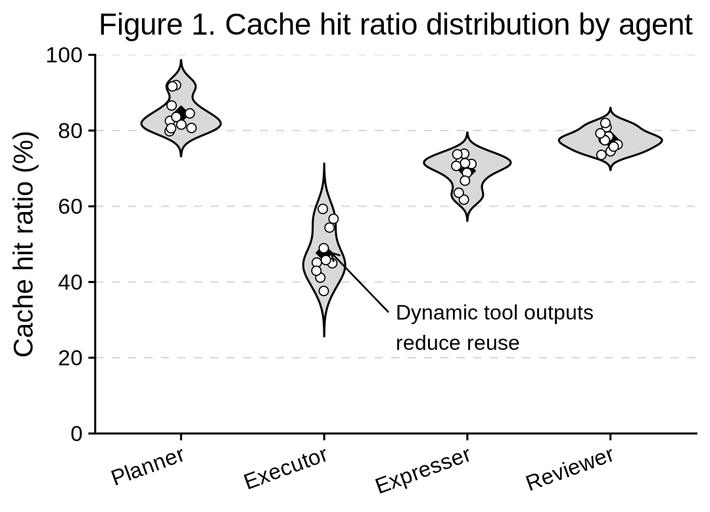
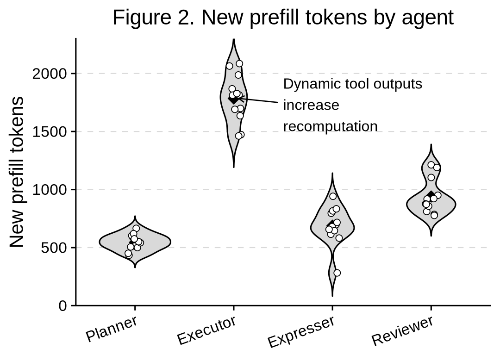
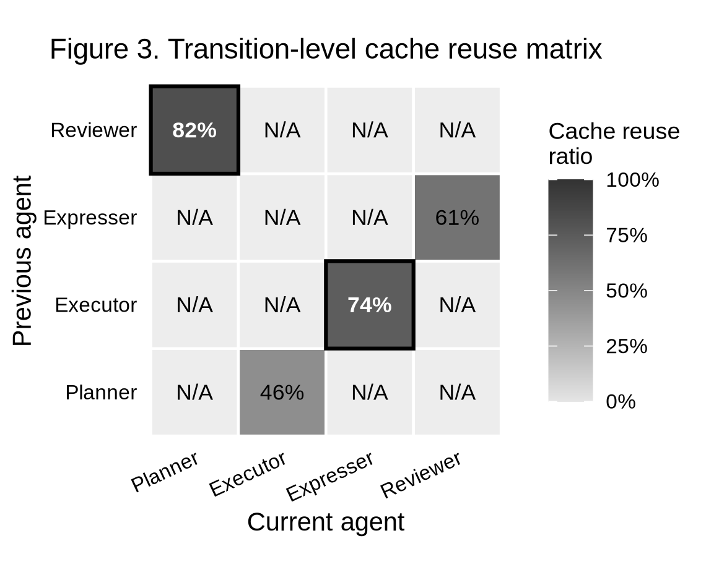
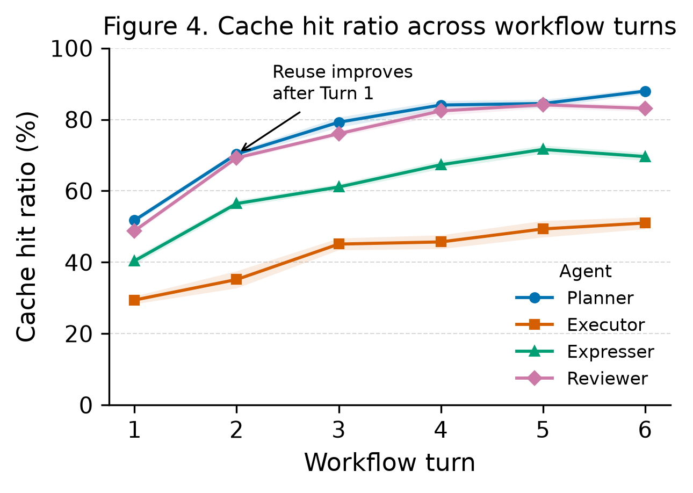

# Data Visualization

## Figure 1. Cache Hit Ratio by Agent

**Purpose:** Identify whether Planner, Executor, Expresser, and Reviewer exhibit different cache reuse behavior.

**Expected observation:** Planner and Reviewer have higher cache-hit ratios; Executor has lower cache-hit ratio due to dynamic tool outputs.

A violin plot shows the distribution of cache hit ratios across repeated runs.

## Figure 2. New Prefill Tokens by Agent

**Purpose:** Measure recomputation burden per agent.

**Expected observation:** Executor contributes the largest number of newly computed prefill tokens.

**Prefill:** LLM processing input prompt tokens before generating output tokens.

**New prefill tokens:** Prompt tokens that cannot reuse existing KV cache and must be recomputed.

**Recomputation burden:** Total newly computed prefill tokens. Higher burden usually means higher prefill latency and TTFT.

**Why Executor highest?** Executor often receives dynamic tool outputs, logs, JSON results, traces, or retrieved content. These change across runs, so prefix reuse is weaker and more tokens must be recomputed.

A violin plot shows the distribution of new prefill tokens across repeated runs.

## Figure 3. Transition-Level Cache Reuse Matrix

**Purpose:** Study whether workflow position affects cache reuse.

**Expected observation:** Executor->Expresser and Reviewer->Planner show stronger reuse than Planner->Executor.

**Why Executor->Expresser is stronger:** Expresser usually consumes Executor's concrete output, such as tool results, logs, retrieved evidence, or execution traces, so the next prompt may share a large suffix/prefix region.

**Why Reviewer->Planner is stronger:** Reviewer's feedback often becomes the next Planner's planning context, so the next cycle can reuse previous review/state tokens.

**Why Planner->Executor is weaker:** Planner gives high-level instructions, but Executor expands them into dynamic tool calls and observations, which are less stable and reduce exact KV reuse.

A matrix shows cache reuse by transition, with rows as previous agents and columns as current agents.

## Figure 4. Cache Hit Ratio Across Workflow Turns

**Purpose:** Analyze cache behavior over repeated PEER cycles.

**Expected observation:** Reuse improves after the first turn, especially for Planner and Reviewer.

For Figure 4, the best choice is a multi-line chart: x-axis is workflow turn, y-axis is cache-hit ratio, and each line is one agent. It directly shows whether reuse improves after Turn 1 and whether Planner/Reviewer improve faster than Executor.

It shows both turn-by-turn trend and agent-specific difference. Planner/Reviewer rising faster after Turn 1 directly supports the expected observation.
